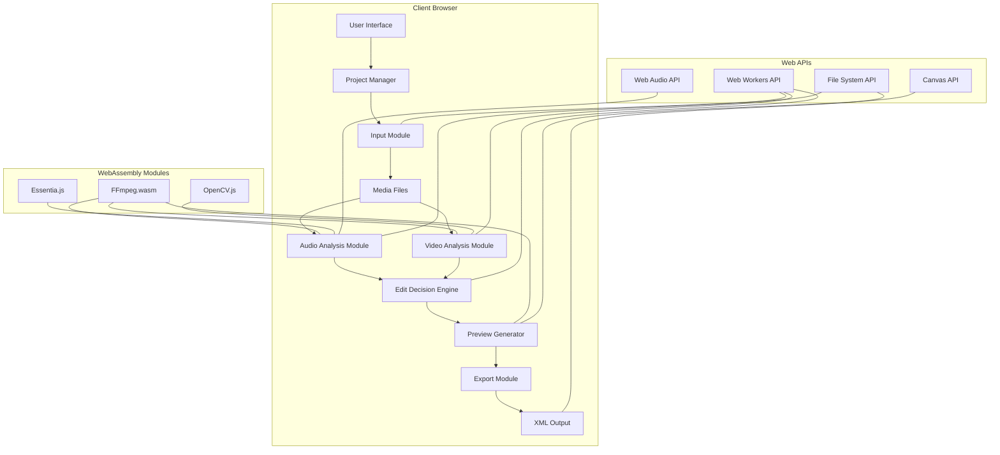

# CineFlux-AutoXML

```
 ██████╗██╗███╗   ██╗███████╗███████╗██╗     ██╗   ██╗██╗  ██╗
██╔════╝██║████╗  ██║██╔════╝██╔════╝██║     ██║   ██║╚██╗██╔╝
██║     ██║██╔██╗ ██║█████╗  █████╗  ██║     ██║   ██║ ╚███╔╝ 
██║     ██║██║╚██╗██║██╔══╝  ██╔══╝  ██║     ██║   ██║ ██╔██╗ 
╚██████╗██║██║ ╚████║███████╗██║     ███████╗╚██████╔╝██╔╝ ██╗
 ╚═════╝╚═╝╚═╝  ╚═══╝╚══════╝╚═╝     ╚══════╝ ╚═════╝ ╚═╝  ╚═╝
                                                              
 █████╗ ██╗   ██╗████████╗ ██████╗ ██╗  ██╗███╗   ███╗██╗     
██╔══██╗██║   ██║╚══██╔══╝██╔═══██╗╚██╗██╔╝████╗ ████║██║     
███████║██║   ██║   ██║   ██║   ██║ ╚███╔╝ ██╔████╔██║██║     
██╔══██║██║   ██║   ██║   ██║   ██║ ██╔██╗ ██║╚██╔╝██║██║     
██║  ██║╚██████╔╝   ██║   ╚██████╔╝██╔╝ ██╗██║ ╚═╝ ██║███████╗
╚═╝  ╚═╝ ╚═════╝    ╚═╝    ╚═════╝ ╚═╝  ╚═╝╚═╝     ╚═╝╚══════╝
```

[](LICENSE)
[](https://reactjs.org/)
[](https://www.typescriptlang.org/)
[](https://tailwindcss.com/)
[](https://vitejs.dev/)
[](https://www.docker.com/)
[](VERSION.md)

## Table of Contents

- [Project Overview](#project-overview)
- [Architecture](#architecture)
- [Quick Start Guide](#quick-start-guide)
- [Technology Stack](#technology-stack)
- [Performance Expectations](#performance-expectations)
- [Documentation](#documentation)
- [License](#license)

## Project Overview

CineFlux-AutoXML is a powerful browser-based application that automatically creates professional music videos by intelligently synchronizing video clips with music tracks. Using advanced audio analysis and visual content recognition, it identifies musical beats, energy levels, and video scene changes to create perfectly timed edits. The system exports industry-standard XML files compatible with professional editing software like Final Cut Pro, Adobe Premiere Pro, and DaVinci Resolve.

### Key Features

- **Intelligent Audio Analysis**: Automatically detects beats, identifies segments, and creates energy profiles from music tracks to drive video editing decisions.
- **Advanced Video Analysis**: Performs scene detection, content analysis, and motion tracking to identify optimal cut points and transitions.
- **Beat-Synchronized Editing**: Precisely matches video cuts and transitions with musical beats and energy changes for professional-quality results.
- **Real-time Preview**: Visualizes edits in the browser before export, allowing for adjustments and fine-tuning.
- **Multi-format Export**: Generates industry-standard XML files (FCPXML, Adobe Premiere Pro XML, DaVinci Resolve XML) for seamless integration with professional editing software.
- **Browser-based Processing**: Performs all operations client-side using WebAssembly technologies, ensuring privacy and eliminating the need for server uploads.

### Use Cases and Target Audience

- **Content Creators**: YouTubers, social media influencers, and digital marketers looking to create engaging music-driven content quickly.
- **Music Video Producers**: Professional and amateur music video creators seeking to streamline their workflow.
- **Editors**: Video editors looking for a tool to automate the initial synchronization of music and video.
- **Musicians**: Artists wanting to create promotional videos for their music without extensive editing knowledge.
- **Event Videographers**: Wedding and event videographers creating highlight reels synchronized to music.
- **Educational Institutions**: Schools and universities teaching video production with limited resources.

## Architecture

CineFlux-AutoXML uses a client-side processing architecture that leverages WebAssembly for high-performance audio and video processing directly in the browser.

### Architecture Diagram



### Architecture Explanation

CineFlux-AutoXML is built on a modular architecture that processes everything client-side:

1. **Input Module**: Handles file uploads and initial processing of audio and video files.
2. **Audio Analysis Module**: Analyzes music tracks to detect beats, energy levels, and segments.
3. **Video Analysis Module**: Processes video clips to detect scenes, content, and motion.
4. **Edit Decision Engine**: Combines audio and video analysis to generate synchronized edit decisions.
5. **Preview Generator**: Creates a real-time preview of the edited video.
6. **Export Module**: Generates industry-standard XML files for professional editing software.

All processing occurs in the browser using WebAssembly modules (FFmpeg.wasm, OpenCV.js, Essentia.js) and Web APIs (Web Audio API, Canvas API, Web Workers). This architecture ensures user privacy as no media files are uploaded to servers, and provides high performance through optimized compiled code.

## Quick Start Guide

### Prerequisites

- Node.js 16.x or higher
- npm or pnpm package manager
- Modern browser with WebAssembly support (Chrome 74+, Firefox 78+, Safari 14.1+, Edge 79+)
- Git

### Installation

#### Standard Installation

1. Clone the repository:
   ```bash
   git clone https://github.com/your-username/cineflux-autoxml.git
   cd cineflux-autoxml
   ```

2. Install dependencies:
   ```bash
   # Using npm
   npm install
   
   # Using pnpm (recommended for faster installation)
   pnpm install
   ```

3. Start the development server:
   ```bash
   # Using npm
   npm run dev
   
   # Using pnpm
   pnpm dev
   ```

4. Open your browser and navigate to:
   ```
   http://localhost:5173
   ```

#### Docker Installation

For Docker-based installation:

1. Start the development environment:
   ```bash
   docker-compose up app-dev
   ```

2. Or start the production environment:
   ```bash
   docker-compose up app-prod
   ```

### Basic Usage

1. **Upload Media**: Upload your music track and video clips.
2. **Analysis**: Let the application analyze your media files.
3. **Edit**: Review and adjust the automatically generated edit decisions.
4. **Preview**: Watch a real-time preview of your edited video.
5. **Export**: Generate an XML file for your preferred editing software.

For detailed usage instructions, refer to the [User Guide](USER_GUIDE.md).

## Technology Stack

CineFlux-AutoXML is built using a modern web technology stack with a focus on performance and modularity:

### Frontend Framework and Libraries

- **React 18+**: Core UI framework with TypeScript for type safety
- **React Router**: For application navigation and routing
- **Zustand**: Lightweight state management
- **TailwindCSS**: Utility-first CSS framework for styling
- **React Dropzone**: For file uploads
- **WaveSurfer.js**: For audio waveform visualization

### WebAssembly Modules

- **FFmpeg.wasm**: WebAssembly port of FFmpeg for video processing
  - Handles video decoding, encoding, and frame extraction
  - Enables video format conversion and optimization
  
- **OpenCV.js**: WebAssembly port of OpenCV for computer vision
  - Performs scene detection and video content analysis
  - Enables motion tracking and visual feature extraction
  
- **Essentia.js**: WebAssembly port of Essentia for audio analysis
  - Provides advanced beat detection and tempo estimation
  - Enables music segmentation and energy analysis

### Web APIs

- **Web Audio API**: For audio processing and analysis
- **Canvas API**: For visualization and rendering
- **IndexedDB**: For client-side storage of project data
- **Web Workers API**: For multi-threaded processing

### Build and Deployment Tools

- **Vite**: Fast, modern build tool and development server
- **TypeScript**: For type safety and improved developer experience
- **ESLint & Prettier**: For code quality and formatting
- **Jest & Testing Library**: For unit and component testing
- **Cypress**: For end-to-end testing
- **Docker**: For containerized deployment

## Performance Expectations

### Minimum Hardware Requirements

- **Processor**: Dual-core CPU, 2.0 GHz or higher
- **Memory**: 4 GB RAM (8 GB recommended)
- **Storage**: 500 MB available space for the application
- **Internet**: Broadband connection for initial loading
- **Display**: 1280x720 resolution or higher

### Recommended Hardware

- **Processor**: Quad-core CPU, 2.5 GHz or higher
- **Memory**: 16 GB RAM
- **Storage**: 2 GB available space for the application and temporary files
- **Internet**: High-speed broadband connection
- **Display**: 1920x1080 resolution or higher

### Expected Performance Metrics

| Operation | Low-end Hardware | Mid-range Hardware | High-end Hardware |
|-----------|------------------|-------------------|-------------------|
| Audio Analysis (5 min track) | 45-60 seconds | 20-30 seconds | 10-15 seconds |
| Video Analysis (1 min clip, 1080p) | 60-90 seconds | 30-45 seconds | 15-20 seconds |
| Preview Generation | 2-3x real-time | 1-1.5x real-time | 0.5-0.8x real-time |
| XML Export | 10-15 seconds | 5-8 seconds | 2-4 seconds |

### Browser Compatibility

| Browser | Minimum Version | Recommended Version | Notes |
|---------|----------------|---------------------|-------|
| Chrome  | 74+            | 90+                 | Best performance and compatibility |
| Firefox | 78+            | 86+                 | Good performance, some WebAssembly optimizations may be limited |
| Safari  | 14.1+          | 15+                 | Acceptable performance, some WebAssembly features may be limited |
| Edge    | 79+            | 90+                 | Based on Chromium, similar performance to Chrome |

## Documentation

- [User Guide](USER_GUIDE.md): Detailed instructions for using CineFlux-AutoXML
- [Deployment Guide](docs/DEPLOYMENT.md): Instructions for deploying the application
- [Developer Guide](docs/DEVELOPER.md): Information for developers contributing to the project
- [API Documentation](docs/API.md): Documentation of the application's internal APIs
- [Performance Optimization](docs/PERFORMANCE.md): Tips for optimizing performance

## License

CineFlux-AutoXML is licensed under the MIT License. See the [LICENSE](LICENSE) file for details.

```
MIT License

Copyright (c) 2023-2025 CineFlux-AutoXML Contributors

Permission is hereby granted, free of charge, to any person obtaining a copy
of this software and associated documentation files (the "Software"), to deal
in the Software without restriction, including without limitation the rights
to use, copy, modify, merge, publish, distribute, sublicense, and/or sell
copies of the Software, and to permit persons to whom the Software is
furnished to do so, subject to the following conditions:

The above copyright notice and this permission notice shall be included in all
copies or substantial portions of the Software.

THE SOFTWARE IS PROVIDED "AS IS", WITHOUT WARRANTY OF ANY KIND, EXPRESS OR
IMPLIED, INCLUDING BUT NOT LIMITED TO THE WARRANTIES OF MERCHANTABILITY,
FITNESS FOR A PARTICULAR PURPOSE AND NONINFRINGEMENT. IN NO EVENT SHALL THE
AUTHORS OR COPYRIGHT HOLDERS BE LIABLE FOR ANY CLAIM, DAMAGES OR OTHER
LIABILITY, WHETHER IN AN ACTION OF CONTRACT, TORT OR OTHERWISE, ARISING FROM,
OUT OF OR IN CONNECTION WITH THE SOFTWARE OR THE USE OR OTHER DEALINGS IN THE
SOFTWARE.
```
