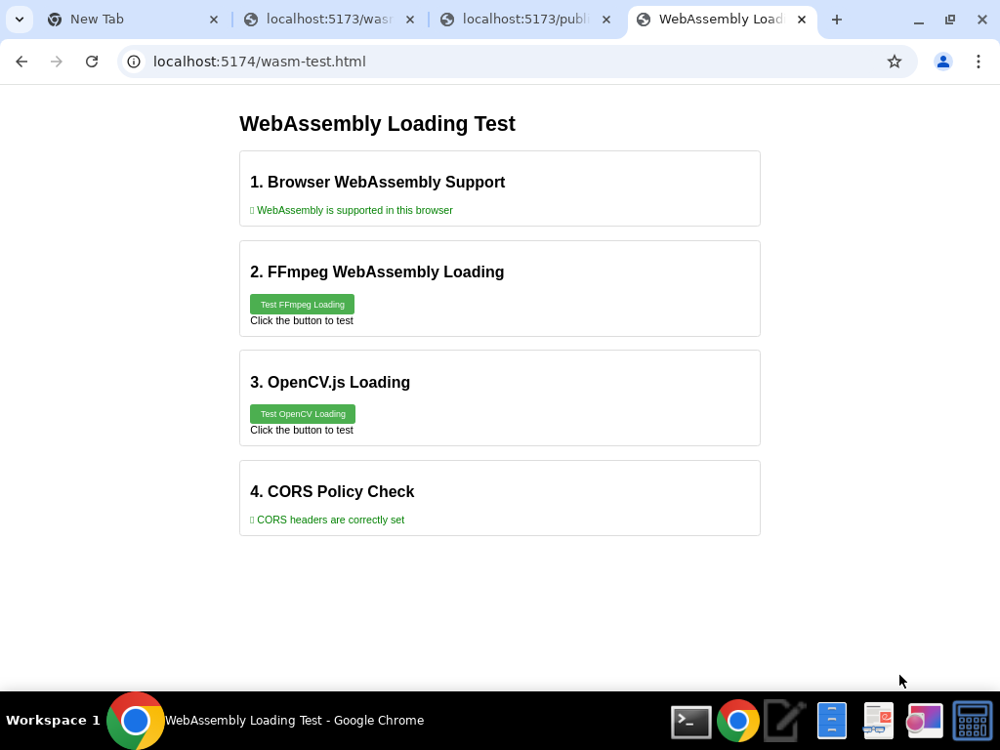
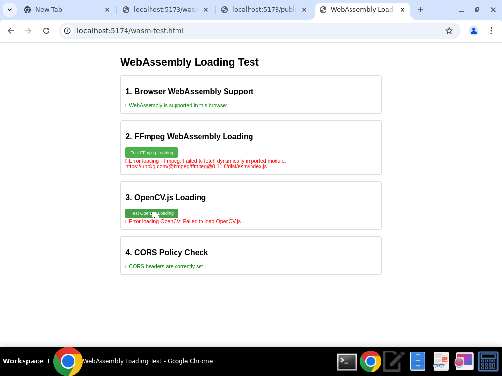
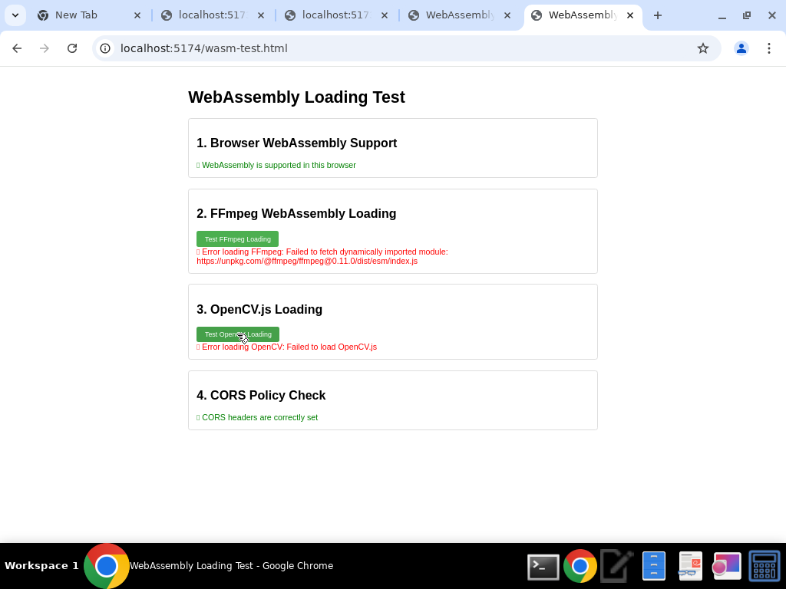

# WebAssembly Loading Test Results
===========================

## Test Environment
- Browser: Google Chrome
- URL: http://localhost:5174/wasm-test.html

## Test Results

### 1. Browser WebAssembly Support
- Status: ✅ WebAssembly is supported in this browser
- WebAssembly object available: Yes
- WebAssembly.instantiate function available: Yes
- WebAssembly.instantiateStreaming function available: Yes

### 2. FFmpeg WebAssembly Loading
- Status: ❌ Error loading FFmpeg
- Error message: Failed to fetch dynamically imported module: https://unpkg.com/@ffmpeg/ffmpeg@0.11.0/dist/esm/index.js

### 3. OpenCV.js Loading
- Status: ❌ Error loading OpenCV
- Error message: Failed to load OpenCV.js

### 4. CORS Policy Check
- Status: ✅ CORS headers are correctly set

## Screenshots

### Initial State


### After Testing


## Conclusion
The browser supports WebAssembly, and the CORS headers are correctly set. However, both FFmpeg.wasm and OpenCV.js failed to load. The FFmpeg.wasm error indicates a problem with fetching the module from the unpkg.com CDN, while the OpenCV.js error is more generic. These issues need to be addressed to enable WebAssembly functionality in the application.

## Recommendations
1. Check network connectivity to unpkg.com and ensure the FFmpeg module is accessible.
2. Consider hosting the FFmpeg.wasm and OpenCV.js files locally instead of relying on external CDNs.
3. Update the FFmpeg.wasm and OpenCV.js versions if necessary.
4. Examine the browser console for more detailed error messages.
5. Test in Firefox to see if the issues are browser-specific.
### Firefox Test Results



The Firefox test shows the same issues as Chrome:
- WebAssembly is supported in the browser
- CORS headers are correctly set
- FFmpeg.wasm fails to load with the same error about fetching the module from unpkg.com
- OpenCV.js fails to load

## Updated Conclusion
The WebAssembly loading issues are consistent across both Chrome and Firefox browsers. This suggests that the problems are not browser-specific but rather related to the application configuration or network connectivity. The CORS headers are correctly set in both browsers, which is a prerequisite for WebAssembly to work properly. However, the application is unable to load the FFmpeg.wasm and OpenCV.js libraries from their respective sources.

## Updated Recommendations
1. Check network connectivity to unpkg.com and docs.opencv.org to ensure the modules are accessible.
2. Consider hosting the FFmpeg.wasm and OpenCV.js files locally instead of relying on external CDNs.
3. Update the FFmpeg.wasm and OpenCV.js versions if necessary.
4. Verify that the paths to the local WebAssembly files (/assets/ffmpeg-core/) are correct and the files exist.
5. Implement proper error handling in the application to provide more detailed error messages when WebAssembly modules fail to load.

## Next Steps
1. Check if the required WebAssembly files exist in the project:
```bash
find /home/ubuntu/cineflux-autoXML -name "*.wasm" -o -name "ffmpeg-core*"
```

2. If the files don't exist, download and install them locally:
```bash
mkdir -p /home/ubuntu/cineflux-autoXML/public/assets/ffmpeg-core
# Download FFmpeg WebAssembly files
# Download OpenCV.js
```

3. Update the wasm-test.html file to use local paths instead of CDN URLs.
